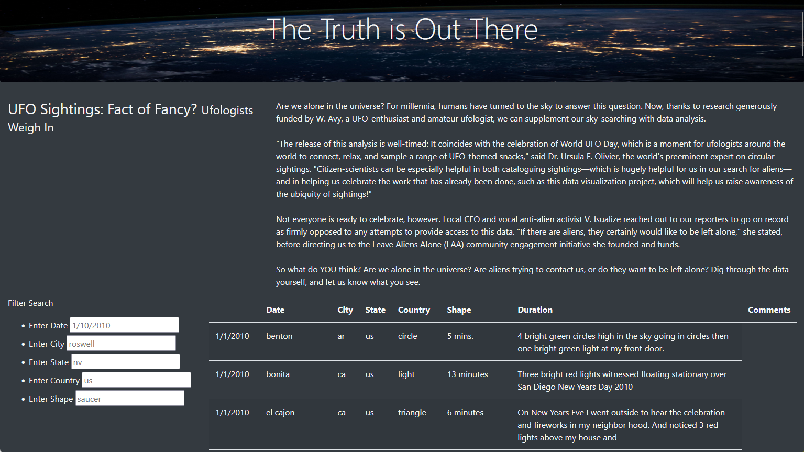

# UFO sightings

## Overview
This project was to create a website where users can read about UFO sightings and filter sighting data based on five criteria. The list of UFO sightings can be filtered by date, city, state, country and UFO shape or any combinations.

## Results
The website has been created with a few sections:

### Header with image
The header "The Truth Is Out There" pops off of the space image background.

### Body article
The title and thoughts on the existence of aliens and UFO sightings engages the user to continue reading.

### Filterable UFO sighting table
The bottom of the webpage is dedicated to UFO sighting data. The summary information displayed can be filtered by five variables.
It can be filtered by a single variable like state as below:

or by multiple filters

## Summary
This project successfully created an engaging website where users can read about and sort through UFO sightings across the world. While the additional filters are helpful in getting to the wanted information, it would be helpful to also be able to sort the results.

### Recommendations

#### Sort functionality
Adding a sort function for filtered results would further enhance the user experience with this website.

#### Drop-downs for some filters
Adding drop-down lists for country, state and city filters would make the filter function easier to use.
